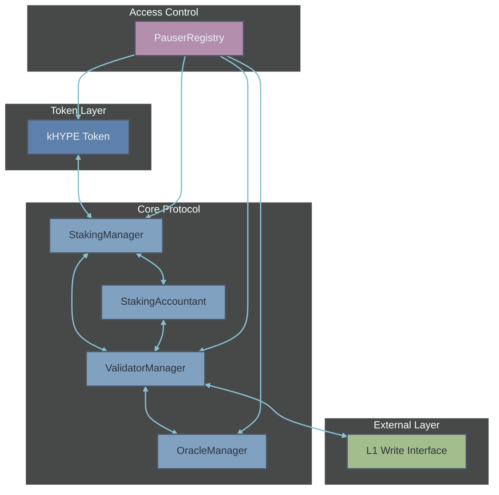
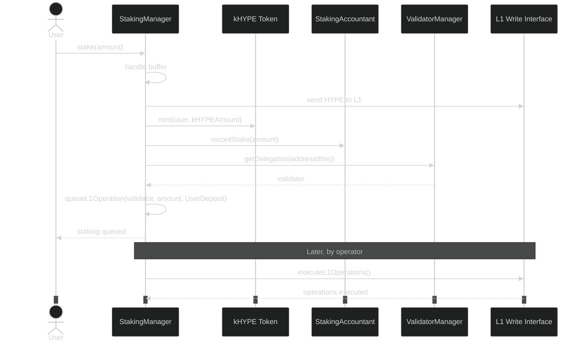
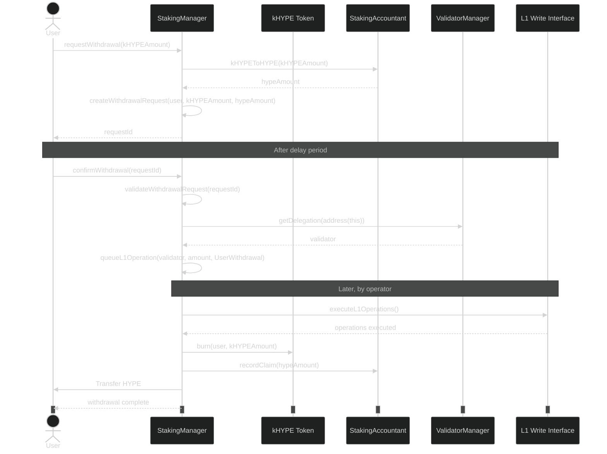
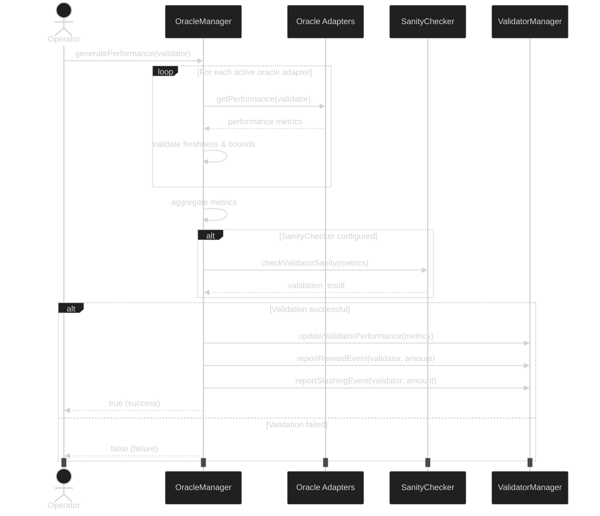

# Smart Contract Architecture

## Overview

This document details the smart contract architecture of the Kinetiq protocol, explaining the various components, their interactions, and security considerations.

> **Note:** This documentation reflects the current implementation and will evolve as the Kinetiq protocol and the broader Hyperliquid ecosystem change and upgrade.

## Core Components

The Kinetiq protocol consists of several core smart contract components:



### StakingManager

The StakingManager is the central component of the protocol:

- Manages deposits and withdrawals of HYPE tokens
- Coordinates with kHYPE token for minting and burning
- Tracks user balances and withdrawal requests
- Manages the buffer for liquidity
- Handles L1 operations queue for deposits and withdrawals
- Enforces staking limits and whitelist if enabled

**Key Functions**:
```solidity
function stake(uint256 amount) external;
function requestWithdrawal(uint256 kHYPEAmount) external returns (uint256 requestId);
function confirmWithdrawal(uint256 requestId) external;
function cancelWithdrawal(uint256 requestId) external;
function queueL1Operations(address[] calldata validators, uint256[] calldata amounts, OperationType[] calldata operationTypes) external;
function executeL1Operations(uint256 count) external;
```

### ValidatorManager

The ValidatorManager handles validator operations:

- Maintains the set of active validators
- Tracks validator balances and performance metrics
- Processes rewards and slashing events
- Manages validator delegation
- Provides validator selection for staking operations
- Handles rebalancing of funds between validators

**Key Functions**:
```solidity
function activateValidator(address validator) external;
function deactivateValidator(address validator) external;
function reportRewardEvent(address validator, uint256 amount) external;
function reportSlashingEvent(address validator, uint256 amount) external;
function setDelegation(address stakingManager, address validator) external;
function rebalanceWithdrawal(address stakingManager, address[] calldata validators, uint256[] calldata withdrawalAmounts) external;
```

### OracleManager

The OracleManager serves as the validator performance reporting mechanism:

- Collects and aggregates validator performance metrics from oracle adapters
- Manages authorized oracle adapters and their active status
- Enforces performance bounds and data freshness requirements
- Performs sanity checks on validator metrics
- Reports validated rewards and slashing events to the ValidatorManager
- Updates validator performance metrics in the ValidatorManager

**Key Functions**:
```solidity
function authorizeOracleAdapter(address adapter) external;
function deauthorizeOracle(address adapter) external;
function setOracleActive(address adapter, bool active) external;
function generatePerformance(address validator) external returns (bool);
function setSanityChecker(address newChecker) external;
function setMinValidOracles(uint256 newMinimum) external;
```

### StakingAccountant

The StakingAccountant manages global accounting and exchange rates:

- Tracks total staked HYPE across all staking managers
- Tracks total claimed HYPE
- Calculates the exchange ratio between HYPE and kHYPE tokens
- Manages multiple kHYPE tokens for different staking managers
- Provides conversion functions between HYPE and kHYPE
- Tracks unique kHYPE tokens to avoid double-counting

**Key Functions**:
```solidity
function authorizeStakingManager(address manager, address kHYPEToken) external;
function deauthorizeStakingManager(address manager) external;
function recordStake(uint256 amount) external;
function recordClaim(uint256 amount) external;
function kHYPEToHYPE(uint256 kHYPEAmount) external view returns (uint256);
function HYPEToKHYPE(uint256 HYPEAmount) external view returns (uint256);
```

### kHYPE Token

The kHYPE token is an ERC-20 token representing staked HYPE:

- Standard ERC-20 functions with permit functionality
- Minted when users stake HYPE
- Burned when users withdraw HYPE
- Pausable via PauserRegistry
- Role-based access control for minting and burning
- Multiple kHYPE tokens can exist for different staking managers

**Key Functions**:
```solidity
function mint(address to, uint256 amount) external;
function burn(address from, uint256 amount) external;
function initialize(string calldata name, string calldata symbol, address admin, address minter, address burner, address _pauserRegistry) external;
```

## Access Control System

The protocol implements a robust access control system:

### PauserRegistry

The PauserRegistry provides emergency pause functionality:

- Maintains a registry of pausable contracts
- Manages pauser and unpauser roles
- Allows pausing and unpausing of registered contracts
- Provides emergency pause-all capability
- Tracks pause states for all registered contracts

**Key Functions**:
```solidity
function pause(address contractAddress) external;
function unpause(address contractAddress) external;
function pauseAll() external;
function unpauseAll() external;
function isPaused(address contractAddress) external view returns (bool);
function authorizeContract(address contractAddress) external;
function deauthorizeContract(address contractAddress) external;
```

## Contract Interactions

### Staking Flow



### Withdrawal Flow



### Oracle Reporting Flow



## Exchange Ratio Calculation

The StakingAccountant calculates the exchange ratio between HYPE and kHYPE tokens:

```solidity
function _getExchangeRatio() internal view returns (uint256) {
    // Calculate total kHYPE supply across all unique tokens
    uint256 totalKHYPESupply = 0;
    uint256 uniqueTokenCount = _uniqueTokens.length();
    
    // Sum up the supply of each unique token
    for (uint256 i = 0; i < uniqueTokenCount; i++) {
        address tokenAddress = _uniqueTokens.at(i);
        totalKHYPESupply += IERC20(tokenAddress).totalSupply();
    }
    
    // Return 1:1 ratio when no kHYPE has been minted yet
    if (totalKHYPESupply == 0) {
        return 1e18; // 1:1 ratio with 18 decimals precision
    }
    
    // Calculate total HYPE (in 8 decimals)
    uint256 rewardsAmount = validatorManager.totalRewards();
    uint256 slashingAmount = validatorManager.totalSlashing();
    uint256 totalHYPE = totalStaked + rewardsAmount - totalClaimed - slashingAmount;
    
    // Calculate ratio with 18 decimals precision
    return Math.mulDiv(totalHYPE, 1e18, totalKHYPESupply);
}
```

This ratio ensures that kHYPE tokens automatically increase in value as rewards accrue and decrease in value if slashing occurs.

## Contract Deployed Addresses

| Contract | Testnet Address | Mainnet Address |
|----------|-----------------|-----------------|
| StakingManager | TBD | TBD |
| ValidatorManager | TBD | TBD |
| OracleManager | TBD | TBD |
| StakingAccountant | TBD | TBD |
| kHYPE Token | TBD | TBD |
| PauserRegistry | TBD | TBD |
| SanityChecker | TBD | TBD | 