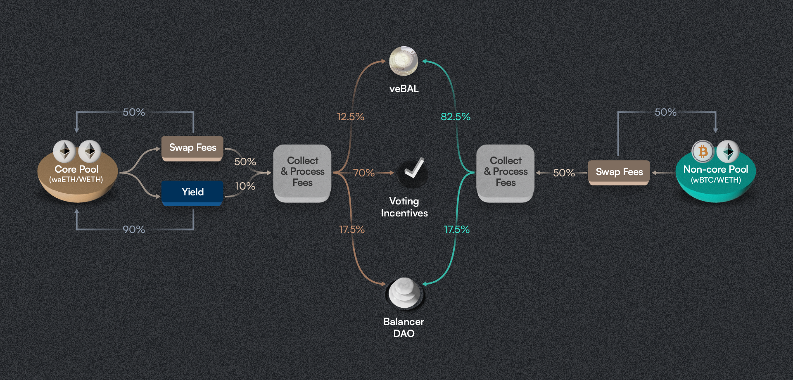

# Protocol Fee Model and Core Pool Framework

This documentation outlines Balancer's protocol fee model and core pool framework across Balancer v2 and v3, as established by governance with [BIP-734](https://snapshot.org/#/s:balancer.eth/proposal/0x7a451385e49e341dce818927bf36aa35dfc6e42dabe328cb34e873c84fa452e4).

## Summary

Balancer's protocol fee model is designed to optimize revenue generation and redistribution for liquidity providers (LPs), veBAL holders, and the DAO. The model differs between Balancer v2 and v3, with v3 introducing a more LP-friendly yield fee structure to drive adoption of boosted pools technology.

::: info Key Changes in v3
- Reduced yield fees from 50% to 10% to increase adoption
- Universal 50% swap fees across all pools
- Simplified fee distribution model
- Introduction of boosted pools technology
  :::

## Fee Structure Overview

| Fee Type | Balancer v2 | Balancer v3 |
|----------|-------------|-------------|
| Yield Fees | 50% | 10% |
| Swap Fees | 50% | 50% |

## Fee Distribution Model
Balancer protocol fees are distributed differently based on pool classification. Pools are classified as either core pools or non-core pools:

- **Core Pools**: Pools that meet specific criteria (detailed in Core Pool Framework) and participate in the protocol's incentive flywheel. These pools typically contain yield-bearing assets or serve as primary liquidity venues.
- **Non-Core Pools**: All other pools that don't meet core pool criteria or haven't applied for core pool status.

### Core Pools

| Recipient | Percentage |
|-----------|------------|
| Voting Incentives | 70% |
| veBAL Holders | 12.5% |
| DAO | 17.5% |

### Non-Core Pools

| Recipient | Percentage |
|-----------|------------|
| veBAL Holders | 82.5% |
| DAO | 17.5% |

## Fee Model on Balancer v3

### Fee Structure
- Yield fees: 10% on yield-bearing asset yields
- Swap fees: 50% on all collected swap fees

::: tip Boosted Pools
V3 introduces boosted pools that deploy underlying liquidity into yield-generating markets, allowing any token with an external yield market to be transformed into a yield-bearing asset.
:::

## Fee Model on Balancer v2

### Fee Structure
- Yield fees: 50% on yield-bearing asset yields (unchanged)
- Swap fees: 50% on all collected swap fees (unchanged)

::: warning V2 Changes
The non-core pool fee redirect to core pools (introduced in [BIP-457](https://snapshot.org/#/s:balancer.eth/proposal/0x97856a0a66781666509f8e2d3dfa05aceabc543526e7fa546321f36f44030c03)) has been discontinued.
:::

## Core Pool Framework

The core pool framework establishes criteria for pools to achieve core status and access enhanced benefits.

### Composition Requirements
- Minimum 50% yield-bearing or boosted tokens for weighted or composable stable pools
- 80/20 weighted pools that utilize Balancer as their primarily liquidity hub (e.g. RDNT:WETH 80/20 pool on Arbitrum). Protocols need to apply to core pool status for such pool types (Check the ALCX/ETH [proposal](https://forum.balancer.fi/t/bip-290-designate-alcx-eth-80-20-as-a-core-pool-with-10-emissions-cap/4753) as a good example)
- Must maintain a minimum $100k TVL consistently

### Technical Requirements
- No yield fee exemption
- Fee settings delegated to Balancer governance in some form or another (no sovereignty on fees)
- Alternative protocol fee setting required if default settings unavailable

### Token Requirements
- Verified smart contracts for all tokens
- No transfer restrictions or rebasing mechanics

### Core Pool List Maintenance
The Balancer Maxis are running and maintaining automation jobs that query on-chain states of all pools deployed on Balancer v2 and v3 that also have a veBAL gauge active. Based on this data following procedures are executed:
- Bi-weekly evaluation of core pool status by checking that a gauge is active and TVL is >= $100k USD
- New pool types require governance approval
- Regular framework review through DAO governance

::: danger Important Note
Core pool status can be lost if requirements are no longer met during bi-weekly evaluations. The currently active core pool list is publicly available via the bal_addresses Maxis [repository](https://github.com/BalancerMaxis/bal_addresses/blob/main/outputs/core_pools.json).
:::

## References and Additional Resources

1. [Protocol Fee Dune Dashboard](https://dune.com/balancer/protocol-fees)
2. [Core Pools Analytics Dashboard](https://balancer.defilytica.com/#/corePools)
3. [Automatic Core Pool List](https://github.com/BalancerMaxis/bal_addresses/blob/main/outputs/core_pools.json)
4. [Fee Distribution Model Analysis](https://docs.google.com/spreadsheets/d/1dx82Hqcw53AwnXOkY3CFSJMshojjT7BzlsKf3zQa-FQ/edit?gid=759201376#gid=759201376)
5. [Core Pool Framework BIP](https://forum.balancer.fi/t/bip-457-core-pool-incentive-program-automation/5254)
